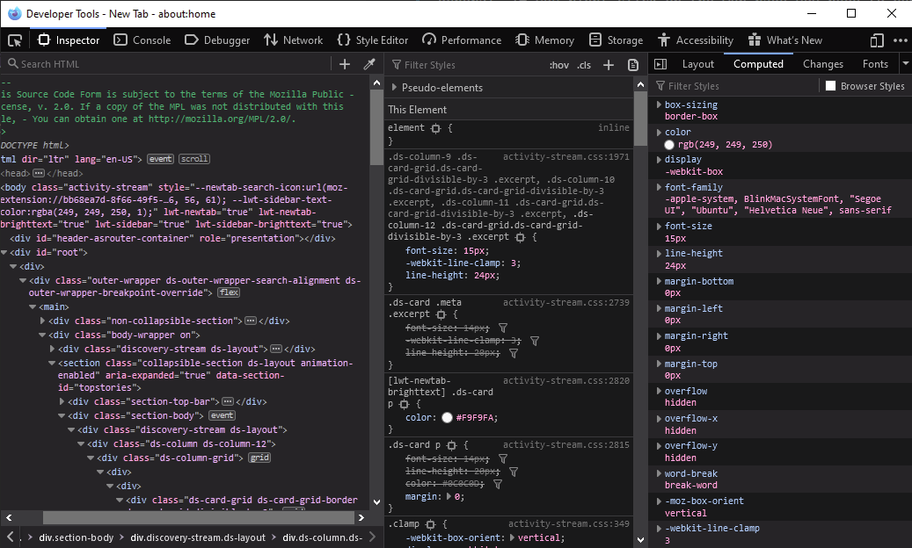
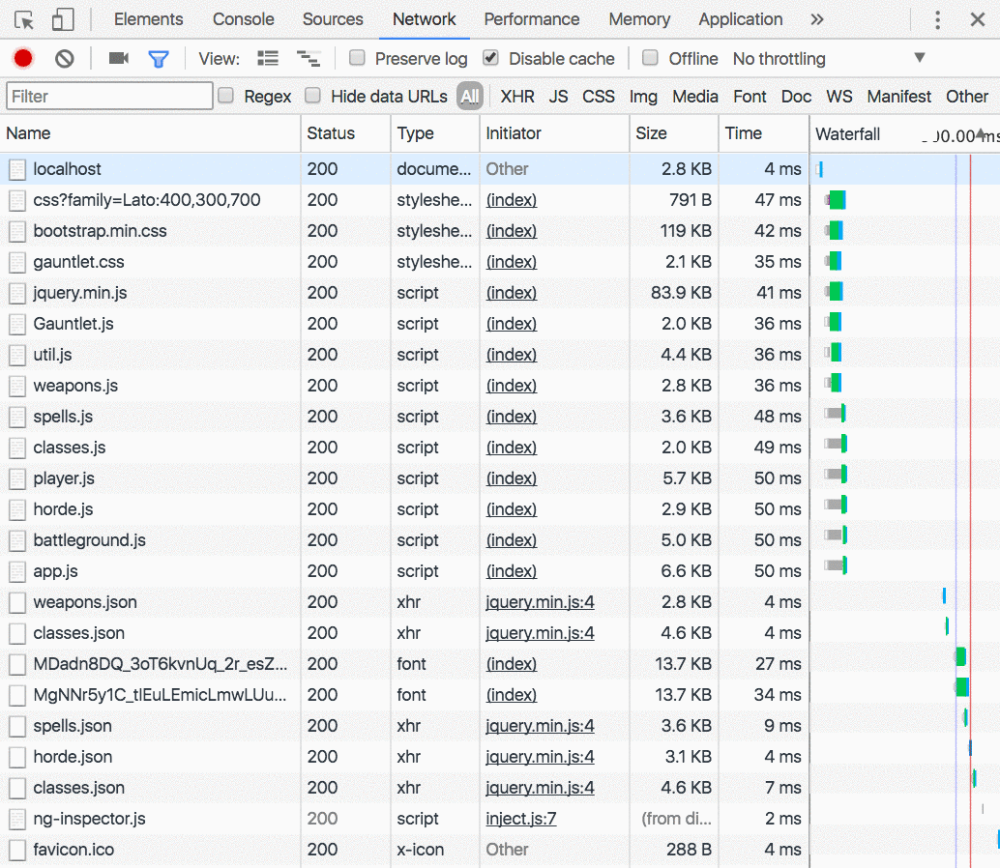
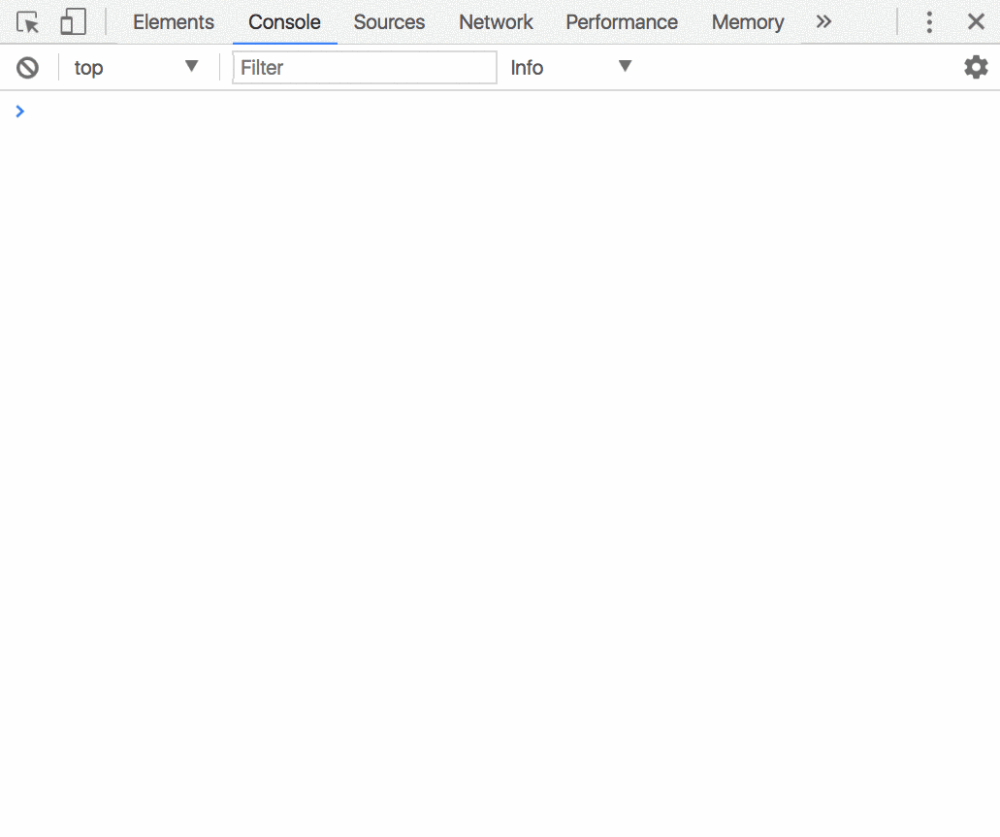

# Debugging and the Browser Developer Console
Debugging your code is one of the most crucial skills as a developer. Several tools are at your disposal to assist you in this effort. 

## Browser Developer Console
All modern IDEs provide advanced debug capabilities, but today's web browsers all also include debugging facilities. While not on par with what you may get from your IDE, the built-in web browser development console is a powerful tool and will be used extensively in class.

How you access the development console for a given browser depends on the browser you are using, but in general, if you right-click on the web page you need to debug you can select `Inspect Element`from the popup menu and the tool will display.

### Inspecting the DOM
The inspection tool allows you to look at the details of all objects being rendered in the browser. This view is super useful when debugging issues with the display of your web pages. 

Highlighting an object in the document object model (discussed more later) will give you all details about the element including styling (CSS) details. The developer consoles in browsers even allow you to temporairly edit the details of the document displayed so you can determine the exact settings you want for the display you desire.

> Note that changes in the developer console DO NOT actually modify the source code that generated the output. The changes are just temporary and meant for debugging and tweaking your styling.



### Reading Errors
Regardless of the programming language. When an error occurs, it will return a stack trace. A stack trace shows the last few areas of code that led up to the error being generated, including the line of code where the crash occurred. 

Sometimes a stack trace looks scary, but just start at the bottom of the output and work your way up. Some of the code referenced might not be code you wrote and instead be code in the tool or framework you are using. 

Modern browser developer tools will generally include a hyperlink as part of the stack trace output so that you can click and jump right to the line in the source code that is in error.

> Not all stack traces will be displayed in the browser console. Some will be displayed in the terminal where you are running your application.

Look for other clues in the stack trace output that give you a better idea of where the error occurred and why. Most stack traces will include actual line numbers from the source code file where the error was encountered. Watch out for them and start your debugging search there.

### Network Tab
Internet applications consists of several requests/responses. Even though you are viewing a single web page, far more than one network request is being made to retrieve all the code, images, and other linked items via a network protocol called HTTP (HyperText Transport Protocol). Each HTTP request returns a status code, along with the requested data (when request successful). 

[HTTP Status Codes](https://en.wikipedia.org/wiki/List_of_HTTP_status_codes)



## Debugging Code in the Browser
When your web page doesn't display as expected in the browser, the first thing to do is popup the developer tools and check the `console` tab.

The `console` tab will display any exceptions generated while attempting to render the page. The tool is especially when JavaScript is being used. Should an exception (error) occur in your code, the console will display what is called a `stack trace`. A stack trace shows you the last lines of code that were executed leading up to the error. 

In modern browsers, the line of JavaScript that generated the exception is highlighted. You can click on this line in the stack trace to see the actual line in your source code.

> NOTE: You cannot edit the code from here, but you can use the provided information to jump back into your IDE and make any corrections needed



### Application Logging
The good old goto is just logging messages from your code. This means using whatever console logging function is available for your chosen platform. 

For JavaScript this is done by using the `console.log` method. You can log any message you want as well as the values of variables at that point in the code. The messages logged can be as simple as `At step 1` or similar. The key is never assume that the variables/values needed at some point in the code are what you assume them to be. Never hurts to log the values to the console to confirm your assumption. 

> NOTE: Remember to remove all your console debug logs prior to deploying your code to a production environment

All languages provide logging frameworks that provide functionality far beyond your basic `console.log` type facilities. They include filtering of log messages by severity such as DEBUG, INFO, WARNING, and ERROR. Even when not debugging, logging is critical to creating the solutions that you deploy and will be covered in detail during class.

> NOTE: You can never log enough :-P

## try/catch/finally Exception Handling
Every programming language has some version of `try/catch/finally` for dealing with errors in your application. While the syntax across languages may differ, the concept is the same. With exception handling you wrap one or more lines of programming instructions you want to `try` to execute so that should an unexpected error occur while executing the instruction(s) you can `catch` it in your own code and handle it gracefully. By *handling it gracefully* we mean that your solution doesn't completely shutdown, but instead displays/logs appropriate error messages and/or create any resources that may have been missing that resulted in the exception (e.g. not finding a file that your program expected to be available).

In programming languages that support `finally` you are given the opportunity to *optionally* designate programming instructions that should be executed *regardless* of whether an exception occurs or not in the code you are *trying* to execute. The popular scenario is connecting to and using a database. To use a database your code has to open up a network connection to the database management system before it can access any data. Each database connection is one less connection that is made available to other programs, so you *always* want to close and free up the database connection when you are done. Regardless of if an exception occurred or not. The code to close an open database connection(s) would be placed in the `finally` block to *guarantee* that the connection is closed and made available to other programs.

The typical try/catch/finally syntax, regardless of the language, will resemble the following, with some slight syntax changes depending on the programming language.

```
try {
  try_statements
}
[catch (exception_var_1 if condition_1) { // non-standard
  catch_statements_1
}]
...
[catch (exception_var_2) {
  catch_statements_2
}]
[finally {
  finally_statements
}]
```

`try_statements`
The statements to be executed.
`catch_statements_1, catch_statements_2`
Statements that are executed if an exception is thrown in the try-block.
`exception_var_1, exception_var_2`
An identifier to hold an exception object for the associated catch-block.
`condition_1`
A conditional expression.
`finally_statements`
Statements that are executed after the try statement completes. These statements execute regardless of whether an exception was thrown or caught.

It is **always** better to handle and exception, and give the user a message, or other valuable feedback rather than your program crashing horribly and kicking the user out.

> **NOTE**: Make sure you are always logging any exceptions that occur. The information is key to you discovering an issue and fixing your code!
