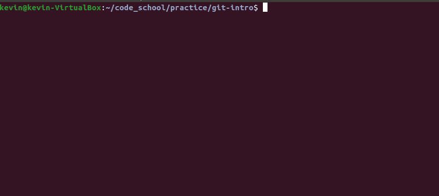
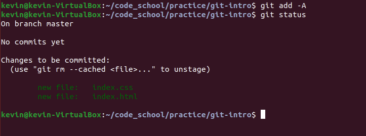
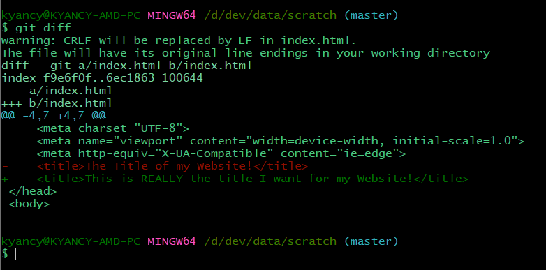
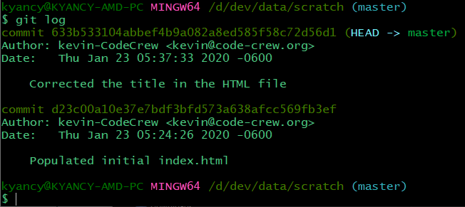
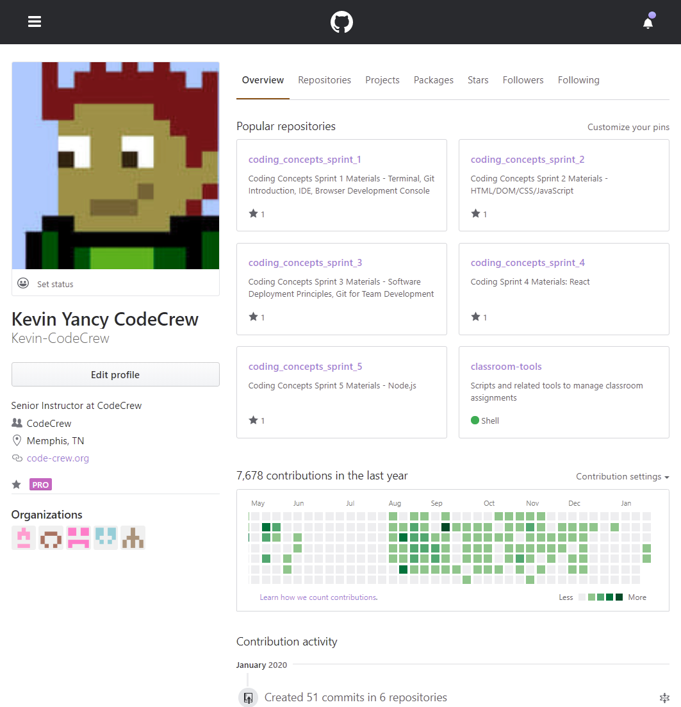
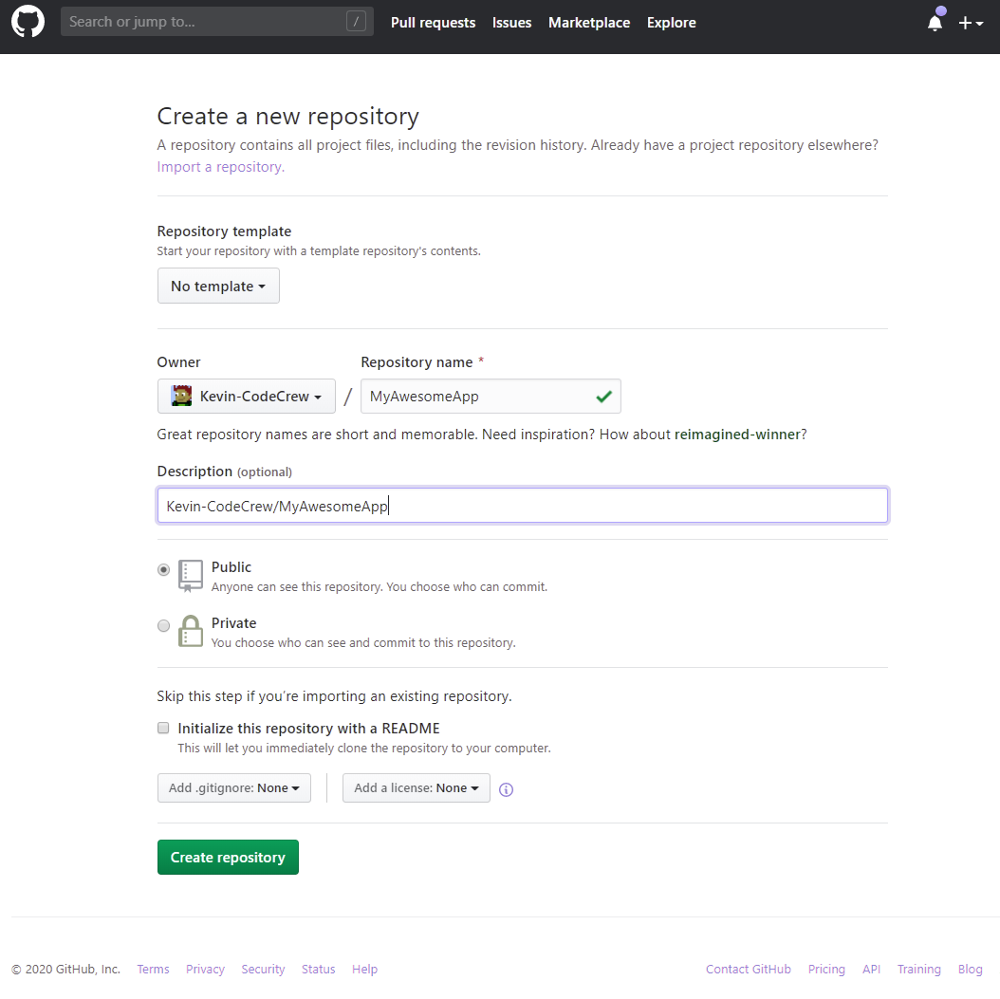
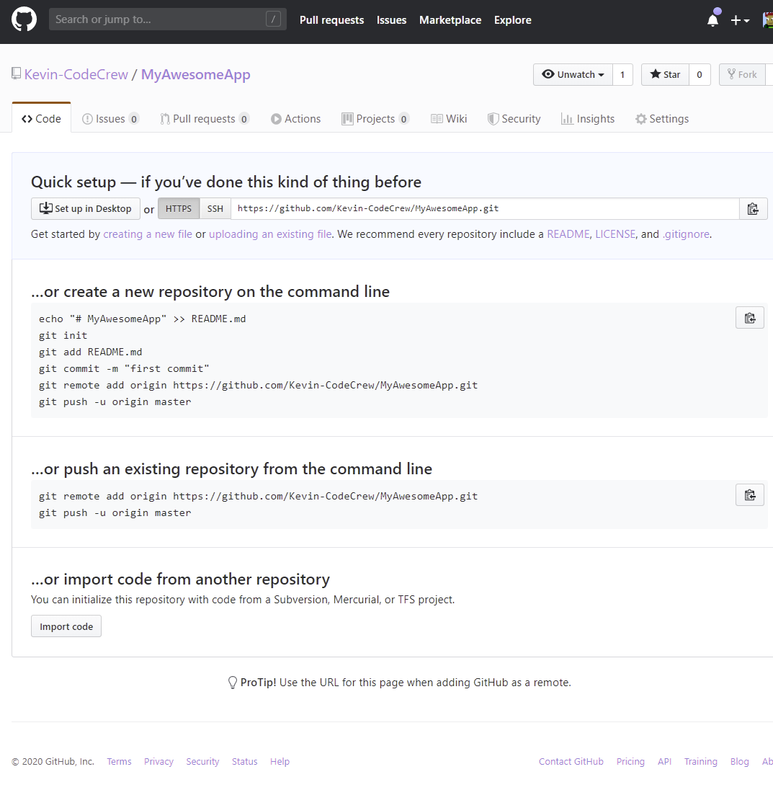
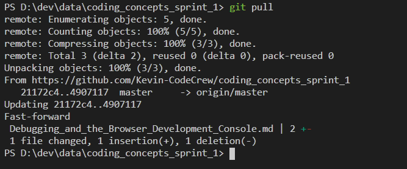

# Introduction to Version Control

Git is one of several version control solutions available to developers. Version control systems allow developers to track changes that make to their solutions. Developers create `repositories` or `repos` for short, and add their source code to them. 

These systems allow the developer to see exactly what changes were made to source code (diff), when, and by whom. Developers can even go back to earlier versions should they new to view older versions or rollback recent changes should the need arise. 

While there are many different version control solutions, Git is presently the most popular and what we will be using in class.

# Git
Git is a distributed version control system for tracking the history of your code. It is called a `distributed` because it supports both `local` (on the developer's machine) as well as `remote` repositories stored on servers out on the internet/network. A popular remote repository service and one that we will use in class is `Github` (more about that later).

# Practice
## Creating a Git Repo Locally
1. Create a directory to store your application's code.
    ```sh
    cd
    mkdir -p workspace/git-intro
    ```
1. `cd` to that directory
1. Type in the `git init` command
1. You now have a local git repository

## Setting the Username and Email for Git
The first time that you commit anything via Github it will require you to specify the user name and the email address associated with your Github account. You can set and save these settings either for *just* the current repository directory you are in or for all repositories you will work on from your machine. The `-global` option is used to specify that the credentials should be used for all repositories. 

If you intend on interacting with other Github repositories using a different Github user account, then set credentials independently, otherwise, the `-global` option should be used so that you aren't repeatedly prompted for this information.

[Setting the User and email for Git](./img/git-config.png)

## Commiting Changes
1. Create an HTML file with `touch index.html`
1. Create a CSS file with `styles.css`

Since git tracks all changes - unless you tell it to ignore some files, which we will cover later - your two new files will be recognized as new, untracked files by git.

Type `git status` to see the status of all files in your new repository.

### git status
The `status` git command will show you any untracked files as well as those that are tracked, but have been modified in some way. Use this command OFTEN to ensure that any and all local changes get committed and ultimately get pushed to your remote repositories.



### git add
Next, Tell git that you want to start tracking those files with `git add -A` command. The `-A` means "add all untracked files from this directory, and any sub-directories". But be careful! Using the `add -A` command means you're adding all untracked files. You can use a `.gitignore` file to exclude certain file types. `.gitignore` is discussed later in this module.

Type `git status` again and notice the new messages that you now have 2 new files that are ready to commit.



### git reset
If you ever accidentally add files to your repository that were not intended, you can use the `reset` command to back out the additions prior to commit by typing `git reset`.

### git commit
When you are done making additions/changes, you must commit your changes for them to be reflected in your repo. 

You can commit individual files by providing a filename or may commit all added changes by specifying no filename. Every commit requires a commit message. It is CRITICALLY IMPORTANT that you provide a useful commit message that sufficiently explains the changes made.

You may specify the commit message on the command line for convenience using the `-m` option. If you omit this option, the default text editor for the current computer will launch so you can type the commit message. In general, always use the `-m` option.

`git commit -m "Updated nested loops in customer shipment history module so that related shipment information is also populated."`

### git diff
Git maintains a log of all changes made to files within a git repository. Github, discussed below, will show a nice color-coded diff (differences) in the browser, however you can always get a simple version of a diff on your local machine.

The `diff` command shows any differences in your local files and the ones committed to your repository. Text removed from your source code is marked in the color red and preceeded by a `-` sign, while additions will show up in green and preceeded by a `+` sign.



### git log
Github allows easy access to all of the commit messages made while commiting additions/changes to source code, however you can access this log information locally as well by using the `log` git command.

`git log`



# Using Github
Github is a service that hosts remote git repositories. New and similar options are emerging, but we will use extensively in class.

## Creating an Account
Go to `github.com` to create an account. Once an account is created, a developer profile page will be created that let's you access your remote repositories as will as view your activity.



## Creating a Github Repository
Select `Repositories` in Github to list your current repositories. Select `New` to create a new remote repository.

When creating the remote repo first (i.e. you do not have source code files in an existing local repo), you will generally always select to add a README file. The README is a file you use to describe the project in the remote repository.

If you already have a project and source code locally, select NOT to create a README.



## Connecting a Local Repository to a Remote Github Repository
Sometimes you will start coding on your local machine first in a local git repo. Existing projects and files can be added to a new remote Github repo. When creating a Github repo to house an existing local project, be sure you don't select to create a README at creation time. Once the remote Github repo has been created without a README, it will provide handly instructions for adding existing local code. Just copy and paste the commands displayed into your terminal one at a time and run them.



## git clone
If you are starting your work locally from an existing Github repo, you must first `clone` it. The `clone` command requires a git URL. You can find the needed URL by simply going to the repo in Github, click the `Clone or Download1 button, and copy the URL from there.

`git clone https://github.com/Kevin-CodeCrew/coding_concepts_sprint_1.git`

## git push
When you `add` and `commit` changes to your source code, it is first updated in your local repo. In order for the changes to be reflected in your remote repository you must `push` them.

`git push`

## git pull
To ensure your local copy is current with the remote repo use the `pull` command. The `pull` command will fetch any changes you do not have locally.



When working in a team environment where several developers may be working from the same repo it is vital that you keep your local repo current by using `pull`. When pulling you may encounter merge conflicts if you and another developer modified the same files.

Resolving merge conflicts is discussed further in an upcoming module.

## .gitignore File
The `.gitignore` file is used to exclude certain files from being tracked in your repository. The general rule when it comes to software development and source code control is that only the files needed to re-constitute the software solution should be checked in and tracked, and subsequently deployed as part of your **production** deployment to your server(s). 

Files like databases, executables (.exe, .bin, etc.) normally should not be tracked as they are generated from your source code. Databases in particular should normally not be checked in as each time you update your application on your production server, you could end up wiping out all your data (such as wiki entries) and replacing it with records created while developing the solution.

You can create as many `.gitignore` files as are needed. The `.gitignore` file will apply to any files in the current subdirectory and all subdirectories where you run git commands from. 

There are several convenient sources to get pre-built `.gitignore` files for common project types (django, node.js, etc.) but you may create your own using your favorite text editor. In the `.gitignore` file simply add the directory names and file names to ignore. Use wildcards to exclude multiple files of a given type (e.g. *.exe). See the [Additional Information](./Introduction_to_Git.md#additional-information) section for links to pre-built `.gitignore` files.

# Additional Information
+ [Using Markdown in your Github README files](https://github.com/adam-p/markdown-here/wiki/Markdown-Cheatsheet#images)
+ [git - The Simple Guide](http://rogerdudler.github.io/git-guide/)
